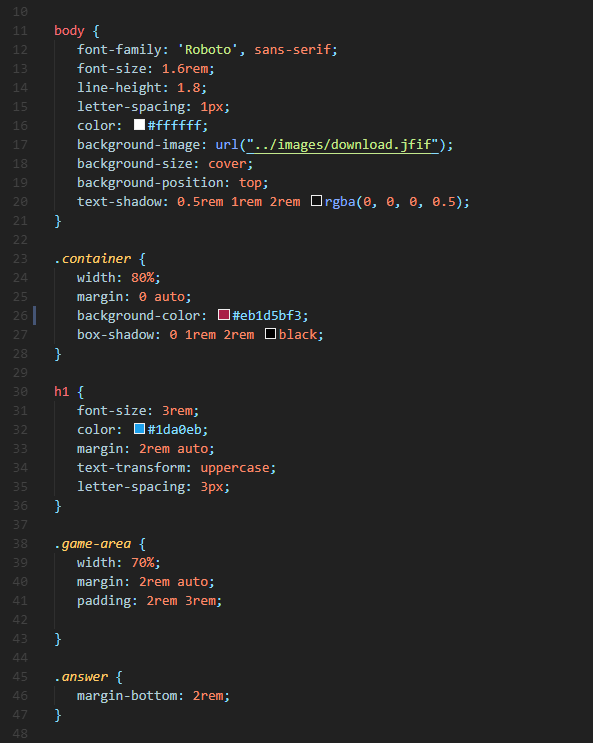
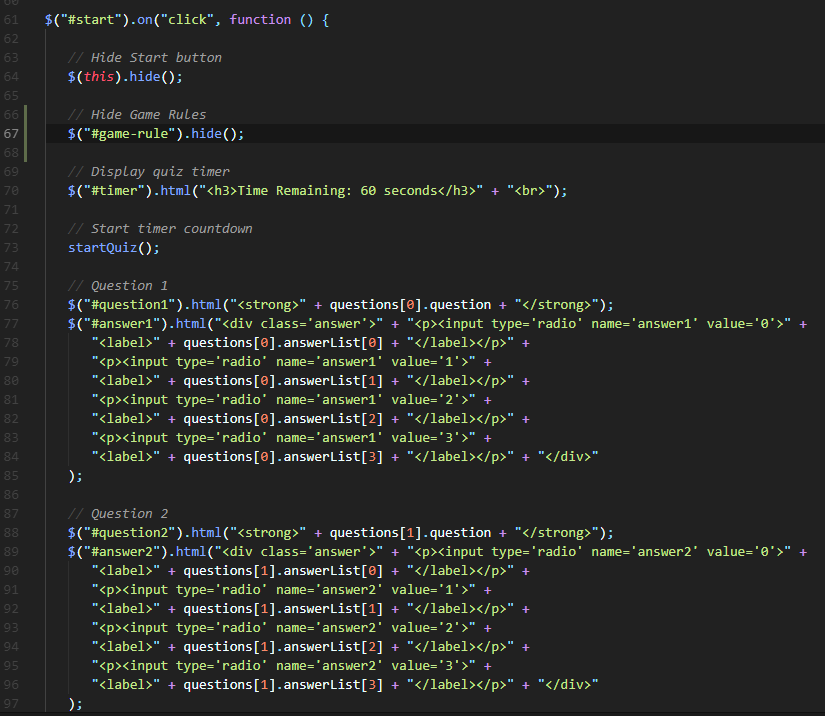
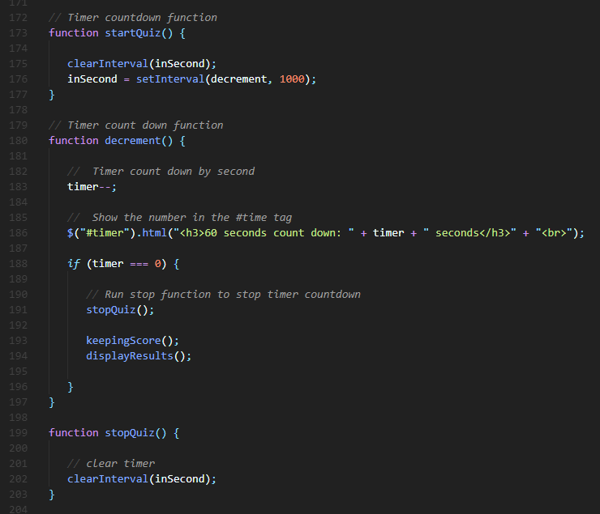
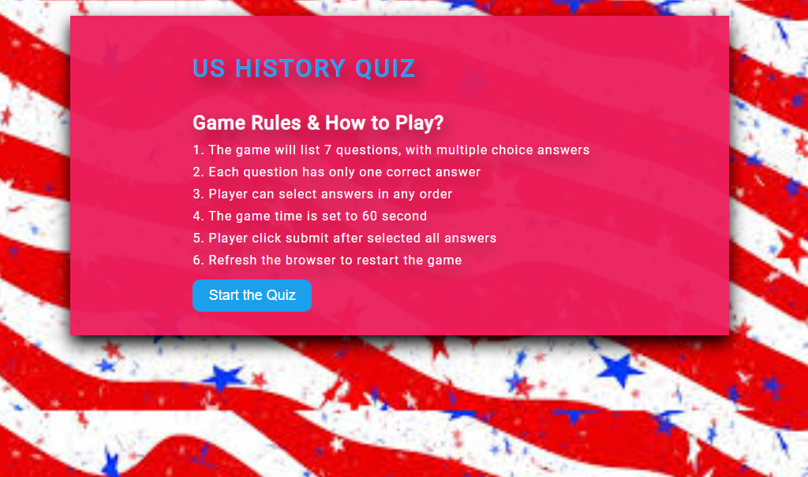
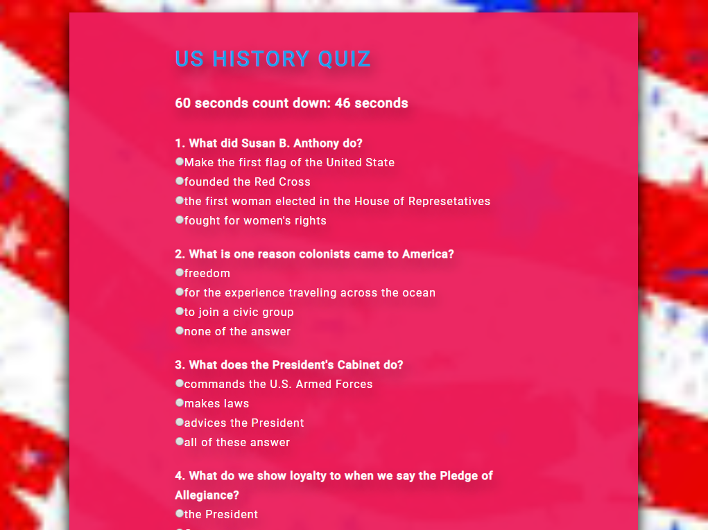
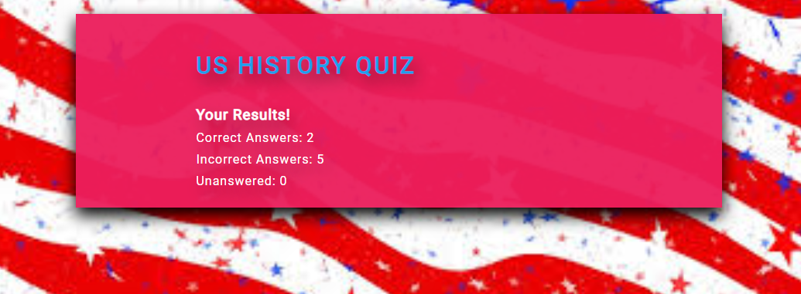

# Trivia Game
## Multiple Choice Question Game
A homework assignment to build a Trivia Game using JavaScript for the logic and JQuery for HTML attribute and element manipulation, and page layout with CSS.

## Homework Assignment Instruction
[Timmers Homework](https://ucb.bootcampcontent.com/UCB-Coding-Bootcamp/UCB-VIRT-FSF-PT-09-2019-U-O/blob/master/course-content/05-timers/homework/Instructions/homework-instructions.md)
## Technology Used
HTML, CSS, JavaScript, and JQuery

## Version Control
[Git & GitHub](https://github.com/monksedo/TriviaGame)

## Game Rules
### Game Rules & How to Play?
1. The game will list 7 questions, with multiple choice answers
2. Each question has only one correct answer
3. Player can select answers in any order
4. The game time is set to 60 second
5. Player click submit after selected all answers
6. Refresh the browser to restart the game

## Start The Game
[Click here to start](https://monksedo.github.io/TriviaGame/)

## CSS Code Snippets

## JavaScrip Code Snippets
### Example 1

### Example 2

## App Screenshots
### Game Start

### Display Questions

### Display Score

